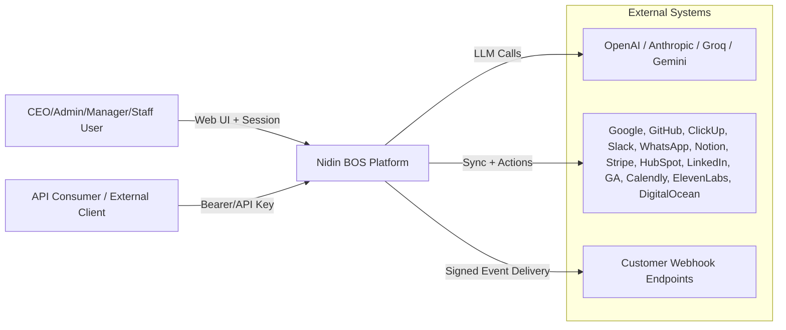
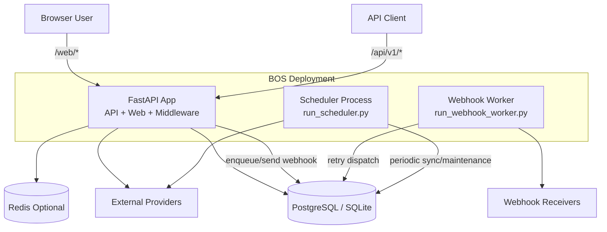
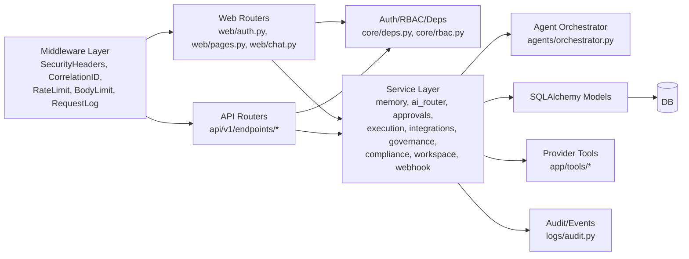
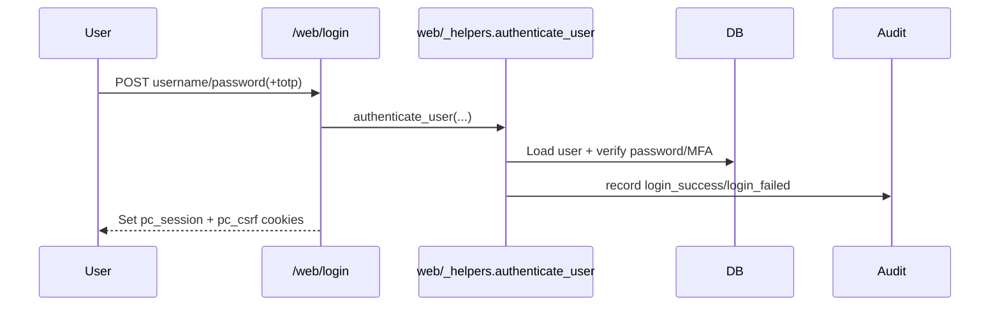
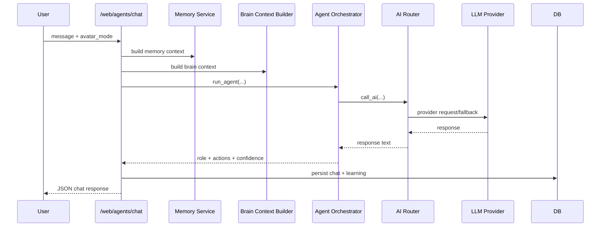
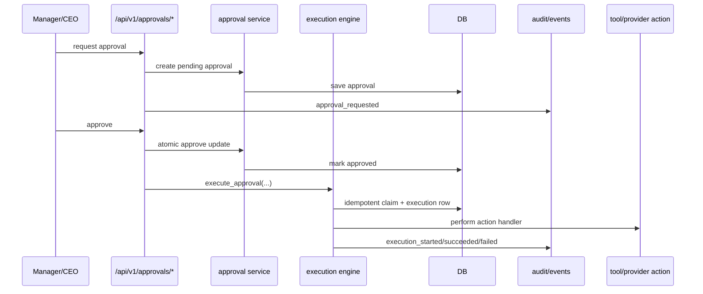
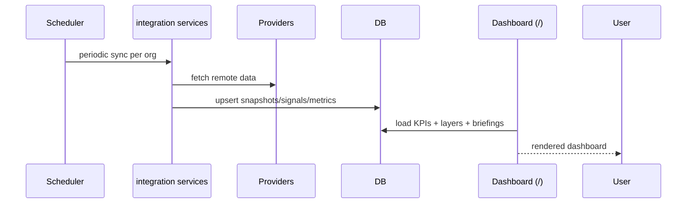

# C4 Architecture - Nidin BOS

This document describes the current architecture of AI BOS using a C4-style view:

1. System Context
2. Container Diagram
3. Component Diagram
4. Key Runtime Sequences

Source of truth for implementation is the code under `app/`, `run_scheduler.py`, and `run_webhook_worker.py`.

## 1) System Context

### Context Notes
- End users interact through server-rendered web pages and JS clients.
- Programmatic clients use API routes with bearer JWT or scoped API keys.
- AI BOS orchestrates AI calls, business workflows, integrations, approvals, and governance controls.

## 2) Container Diagram

### Container Responsibilities
- FastAPI App:
  - Auth, RBAC, routing, rendering, business services, audit, AI orchestration.
- Scheduler:
  - Periodic integration sync, trend updates, maintenance jobs, SLA/summary routines.
- Webhook Worker:
  - Retries failed deliveries from DB queue/logs.
- DB:
  - Domain state, snapshots, approvals, memory, events, integrations, governance.
- Redis (optional):
  - Rate-limit/idempotency/support caches.

## 3) Component Diagram (Inside FastAPI App)

### Major Components and Code Mapping
- App bootstrap and startup guards:
  - `app/main.py`
- Middleware:
  - `app/core/middleware.py`
- Auth, deps, RBAC:
  - `app/core/deps.py`
  - `app/core/rbac.py`
  - `app/core/security.py`
- API router composition:
  - `app/api/v1/router.py`
- Web routes:
  - `app/web/auth.py`
  - `app/web/pages.py`
  - `app/web/chat.py`
- Agent orchestration:
  - `app/agents/orchestrator.py`
- AI provider abstraction:
  - `app/services/ai_router.py`
- Approval + execution control:
  - `app/api/v1/endpoints/approvals.py`
  - `app/services/approval.py`
  - `app/services/execution_engine.py`
- Integration and webhook subsystems:
  - `app/api/v1/endpoints/integrations.py`
  - `app/services/integration.py`
  - `app/services/webhook.py`
- Memory/workspace subsystems:
  - `app/services/memory.py`
  - `app/api/v1/endpoints/memory.py`
  - `app/services/workspace.py`
  - `app/api/v1/endpoints/workspaces.py`
- Governance/compliance:
  - `app/services/compliance_engine.py`
  - `app/api/v1/endpoints/control/ceo.py`
- Data model registration:
  - `app/models/registry.py`

## 4) Key Runtime Sequences

### 4.1 Login + Session

### 4.2 Talk Request + Memory + Agent Routing

### 4.3 Approval Request -> Approve -> Execute

### 4.4 Integration Sync + Dashboard Read Model

## Deployment Boundaries

- HTTP app runtime:
  - FastAPI app in `app/main.py`
- Separate process for scheduler:
  - `run_scheduler.py`
- Separate process for webhook retries:
  - `run_webhook_worker.py`

Production guidance and checks:
- `docs/PRODUCTION_RUNBOOK.md`
- `scripts/check_ready.py`

## Design Characteristics

- Style: modular monolith with clear service boundaries.
- Data consistency: SQL transaction boundaries in service methods; idempotency guards on critical flows.
- Safety:
  - RBAC and org scoping in dependency layer.
  - Approval gates for risky actions.
  - Auditable event trail and webhook delivery logs.
- Extensibility:
  - New endpoints by domain module.
  - New provider via `tools/*` + `services/*` + integration endpoint.
  - New agent behavior through orchestrator role/prompt routing.
